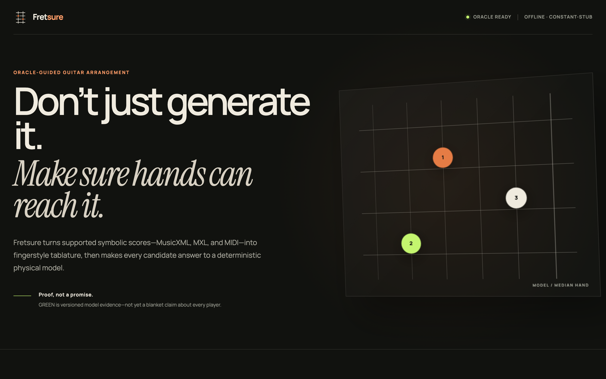
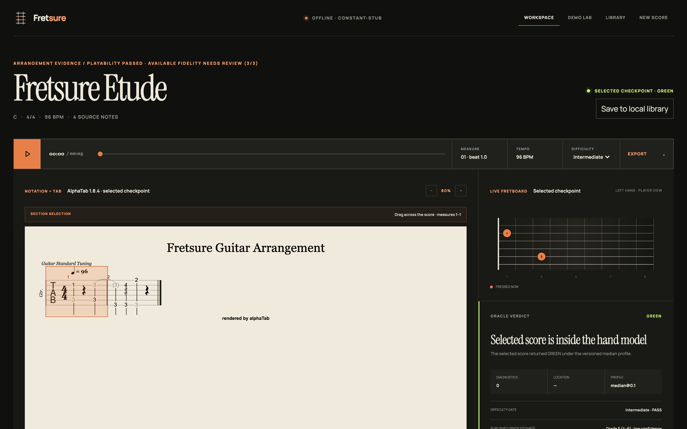
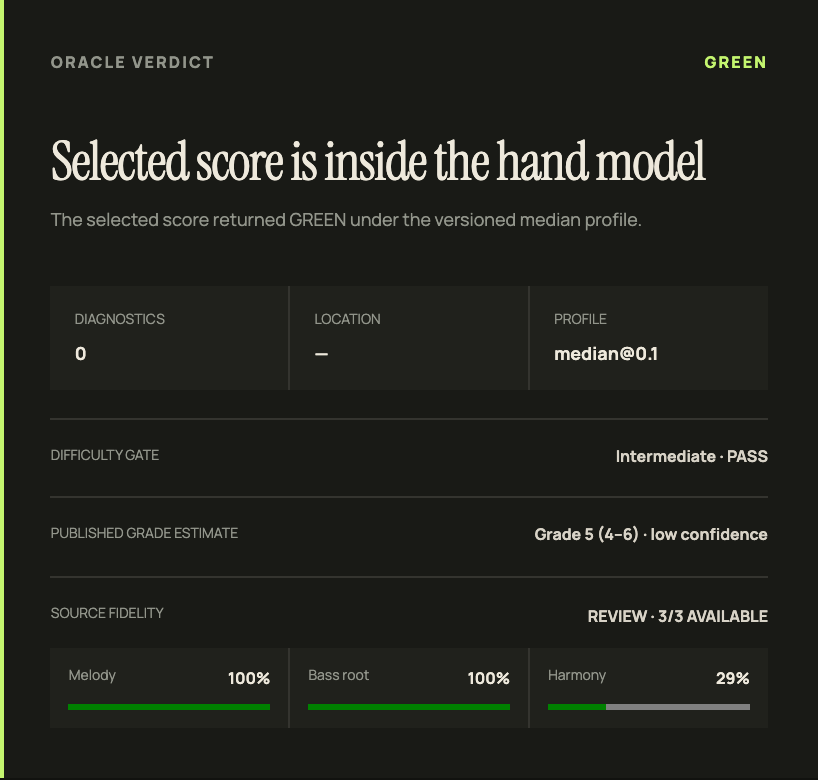
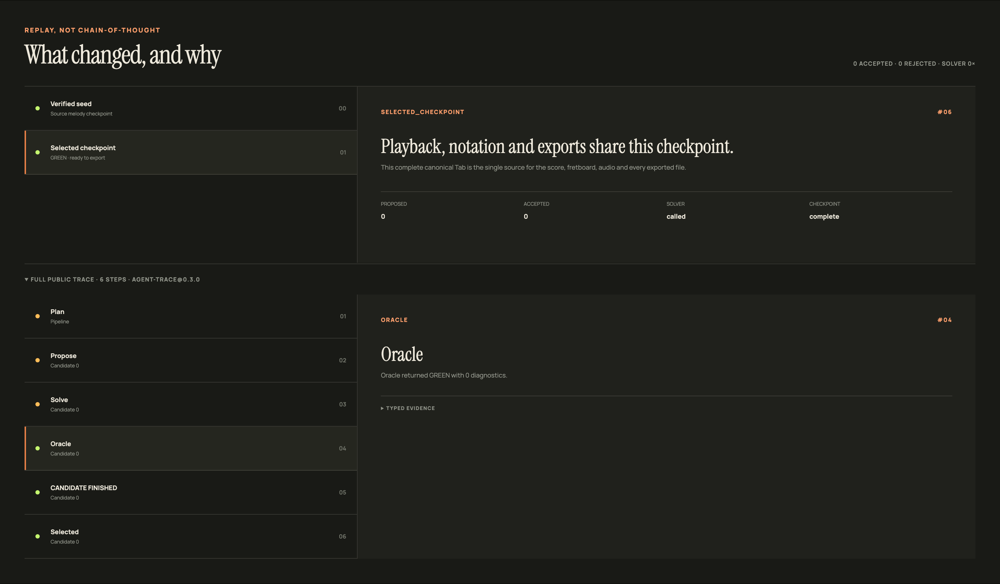
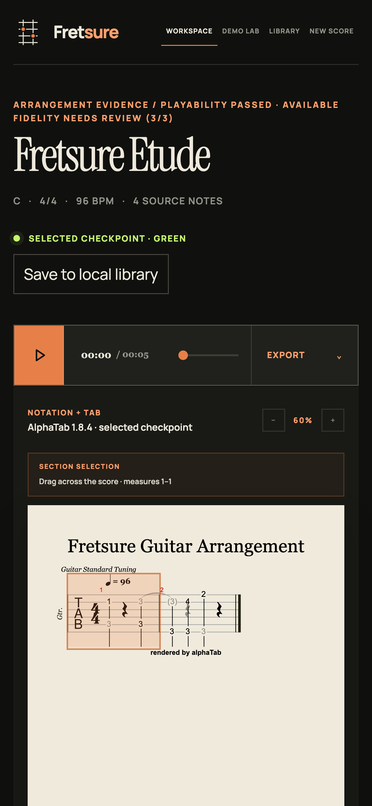

<div align="center">



# Fretsure

**别只是生成它。要确保手能按到。**

一个吉他编配 agent，它的输出必须对物理负责，而不是对另一个模型负责。
LLM 负责提议编配；确定性可弹性 oracle 在版本化手部模型下逐音核验，要么认证，
要么精确指出哪一处按不了。

[](https://github.com/MicroYui/fretsure/actions/workflows/ci.yml)
[](https://github.com/MicroYui/fretsure/actions/workflows/web.yml)
[](https://github.com/MicroYui/fretsure/actions/workflows/docs.yml)
[](https://www.python.org/downloads/)
[](LICENSE)

[English](README.md) · **简体中文**

</div>

---

## 问题

生成式音乐工具产出的吉他谱经常"看起来对、其实弹不了"：同一根弦上同时响两个音、
人手够不到的跨度、来不及移动的把位跳转。模型不知道这些，因为从来没有东西告诉过它。

Fretsure 保留生成的部分——挑哪些音、怎么配声位，LLM 确实更擅长——
然后在它下面放一个确定性验证器。这个验证器不是"感觉一下"，
而是在带指纹的手型 profile 上做毫米级几何计算，并且逐音执行。

## 工作方式

```
lead sheet / MusicXML / MIDI
        │
        ▼
   LLM 提议编配                       ← 口味：选哪些音、怎么配
        │
        ▼
   确定性 beam 指法求解器              ← 这些音落在指板哪里
        │
        ▼
   可弹性 ORACLE ── RED ─────────────► 定位化 typed 诊断
   （毫米几何、active sustain、          （小节、拍、弦、原因）
     跨度/够弦、换把速度）
        │ GREEN / AMBER
        ▼
   独立的 FIDELITY 门                  ← 旋律、低音、和声保住了吗
        │
        ▼
   canonical Tab → 谱面 · 播放 · 指板 · GP7/GP5/MusicXML/MIDI/PDF/ASCII
```

**oracle 当环境、LLM 当策略**。下游不信任任何没过门的提议，
也没有任何一道门去问模型"这个答案看起来好不好"。

接真实 LLM 时，回路刻意是 **baseline-first** 的：源旋律的 onset/pitch/duration 原样成为
GREEN 基线，模型只能**添加**——低音、和声，以及只落在真实静音 gap 里的填充。
每一次增量都要过检查，失败的增量立即回滚，而不是改写旋律或赔掉最后一个 GREEN checkpoint。



## 快速开始

```bash
uv sync --extra dev
uv run fretsure-demo          # 完全离线、确定性
```

```
ARRANGED TAB (high-e on top)
  e|----5---5-------7-------0-------|
  B|--6---------6-8-----------------|
  G|5-----5---5-------7-7-5---5-5-5-|
  D|7---------------5-------7-------|
  A|--------8-----------------------|
  E|--------------------------------|

ORACLE VERDICT
  GREEN — passes the pessimistically tightened versioned model/profile (median@0.1)
  checker oracle@0.3.0, profile median@0.1
  profile SHA-256 fcefa5394cba876b94881fc77886e6db130d8be10406d46538ad6c83c40b7b62
  input schema tab-input@0.2.0

FAITHFULNESS TO INPUT
  melody-F1 1.00   bass-root 1.00   harmony 0.75
  available-dimension gate PASS (3/3 evaluated)
  checker fidelity@0.3.0
```

编配真实文件，或打开本地工作台：

```bash
uv run fretsure-arrange path/to/score.musicxml       # 也支持 .xml / .mxl / .mid
uv run fretsure-serve                                # http://127.0.0.1:8000
```

`fretsure-serve` 自带已构建的 Web 工作台，默认跑确定性 engine——不联网、不需要 key、
不调用模型。只有当你想经 loopback 代理接真实 LLM 时才加 `--allow-proxy`。

按需安装：

```bash
pip install 'fretsure-oracle'                        # 只要 oracle 与求解器
pip install 'fretsure-oracle[service,score,agent]'   # Web 工作台 + importer + LLM
```

| extra | 提供什么 |
|---|---|
| `score` / `musicxml` / `midi` | 符号谱导入（music21 精确锁定 `10.5.0`） |
| `agent` | 经 loopback 代理的真实 LLM 编配 |
| `service` | HTTP API、内置 Web 工作台、导出 |
| `exports` | Guitar Pro 5 与 A4 矢量 PDF |
| `mcp` | `fretsure-mcp` stdio 服务 |
| `benchmark` | `fretsure-bench` 采集 |

## GREEN 意味着什么，不意味着什么



GREEN 的含义是：**在 `oracle@0.3.0`、`median@0.1` 手型 profile 之内**，
每个音都通过了对够弦、跨度、同弦冲突、横按几何与换把速度的、被悲观收紧过的检查。
profile 指纹随判决一起走，所以任何主张都能追回到做出它的那个模型。

GREEN **不**意味着"任何吉他手都能弹"。目前唯一一次真人试奏结论是 `PARTIAL`：
一位业余琴手认为整体难度不高，但 `12-10-8-12` 的把位序列没能干净地弹下来。
现实世界误接受率、profile 校准与音乐性都仍然是开放问题，文档在每一处出现相关数字时都会写明。

忠实度是**独立**的一道门，并且有自己的诚实规则：没有源证据的维度记为 `None`，
绝不记成 `1.0`。melody-only 的 MIDI 导入只评旋律，低音与和声报告为不可用，而不是满分。

## 诚实的结果

benchmark 由 checker 打分，不是 LLM 评委。每个 agent 能力都要通过预注册消融来挣得存在，
没挣到的会继续留在 README 里。

**Benchmark v2** —— 500 个独立种子的 procedural families + 3 个许可 public controls，
`gpt-5.6-sol`，10,563 行、45,215 次逻辑调用、两次逐字节一致的 replay：

| 能力 | 对 joint success 的效应 | 裁决 |
|---|---|---|
| verifier-guided repair | **+0.0566** `[0.0456, 0.0682]`，283 改善 / 0 变差 | **`NOT_KEPT`** —— 真实存在，但低于预注册的 `0.10` SESOI |
| best-of-4 search | **+0.068** `[0.048, 0.088]`，McNemar 34/0 | **`PROBATION_COST_UNKNOWN`** —— 效力过关，但 provider token 成本为 `null` |
| critic | joint **−0.002**，self-score `+0.0027` | **`HUMAN_BLOCKED_PROBATION`** —— 没有盲测真人证据 |

头条数字并不好看，也没有被藏起来：被选中的 `full` 策略 joint success 是
**74/500 = 14.8%**（Wilson 95% `[11.96%, 18.18%]`）。
**三个高复杂度格全部为 0，三个 public controls 也全部为 0。**
这是一条实质性的负面泛化结论：procedural families 上的 14.8%
不能证明任意真实曲目能work。

正因为 repair、search、critic 都没过各自的门槛，产品缺省是
`n=1, max_iters=0, use_critic=false`；三者都保留为显式 opt-in。

出版谱监督也按同样标准对待：在 21 首 Public Domain 作品上训练的 ranker，
把 composer-held-out 的精确指号一致率从 29/60 提到 30/60（dev）、30/78 提到 32/78（test），
Oracle 零回退——而随后扩到 58 个 example 的版本**没有**保住这个增益，因此没有被提拔。
完整数字见 [`docs/BENCHMARK_RESULTS.md`](docs/BENCHMARK_RESULTS.md) 与
[`docs/PLAN7B_ACCEPTANCE.md`](docs/PLAN7B_ACCEPTANCE.md)。

## 谁检查检查器

没人审计的 oracle，不过是一个带 API 的意见。验证器自己也有验证台：

- **资源单调性**：1000 个随机 tab 上，更大的手绝不会否掉更小的手接受过的东西；
- **变异体杀伤率 1.0**：12 个注入的 oracle 变异体全部被抓；
- **N-version 差分**：500 个随机帧上与独立实现逐一比对；
- 跨度以**毫米**度量，而不是品数——所以调弦与弦长是有意义的。

## Replay，不是 chain-of-thought



每次运行都产出可回放的 typed trace：提议了什么、求解器返回什么、oracle 怎么判、
最终选了哪个候选。它是决策与证据的记录，不是把模型推理包装成"解释"的文字稿。

## 支持的输入——刻意收窄

Fretsure 宁可拒绝一个文件，也不愿意猜。合同之外的一切都 fail-closed，
并给出 typed、定位化的诊断。

| 输入 | 合同 |
|---|---|
| MusicXML 3.1/4.0 | 单 part/staff/voice 的 lead sheet；未压缩 `.musicxml`/`.xml` 与安全 `.mxl`；外加一种严格的双谱表钢琴缩编（成功时带 `PIANO_REDUCTION_DERIVED`） |
| MIDI | format 0/1、PPQN、固定 tick-zero tempo 与 4/4、单一非打击乐单声部 note stream；raw tick 是时间权威，所有音标为 melody |
| 音频 | 未实现，也不承诺 |

版本 stamp 随每个结果一起走：

| 合同 | 版本 |
|---|---|
| 可弹性 oracle | `oracle@0.3.0` |
| 公共 tab 输入 | `tab-input@0.2.0` |
| 忠实度 | `fidelity@0.3.0` |
| importers | `musicxml@0.4.0`、`midi@0.1.0`、`score-input@0.1.0` |
| 求解器 | `fingering-solver@0.6.0`、`score-solver@0.4.0` |
| 出版谱监督 | `published-fingering-ranker@0.1.0`、`published-grade-estimator@0.1.0` |
| service / API / Web / trace | `0.3.0` · MCP `0.2.0` |

## API 与 MCP

```bash
curl -s http://127.0.0.1:8000/api/v1/capabilities
curl -s --data-binary @score.musicxml \
  'http://127.0.0.1:8000/api/v1/arrangements?filename=score.musicxml'
```

所有导出都来自播放器与指板使用的同一份已核验 checkpoint：
`.gp`（Guitar Pro 7）、`.gp5`、MusicXML TAB、MIDI、A4 PDF、WAV、ASCII 与 canonical Tab JSON。
MCP 服务经 stdio 暴露 `check_playability`、`check_difficulty`、`feasible_fingerings`、
`render_notation` 与 `render_audio`：

```bash
uv run fretsure-mcp
```

细节见 [`docs/WEB_API_MCP.md`](docs/WEB_API_MCP.md)。



## 状态

已经能用：oracle 与求解器、符号谱导入、agent 回路、难度档与简化、伴奏、benchmark，
以及带谱面、播放、同步指板、局部重生成、手动指号编辑与导出的 performance workspace。

仍然开放（在拿到证据之前会一直开放）：真人 gold 标注、现实世界误接受率、
profile 与难度对真实琴手的校准、跨供应商比较，以及完整 replay 包的公开再分发。

## 开发

```bash
uv sync --extra dev
uv run ruff check && uv run mypy --strict src
uv run pytest -q -m 'not integration'      # 2,730 个离线测试
cd web && npm ci && npm test && npm run build
```

`Full validation`（手动触发的 GitHub workflow）另外会跑集成边界、最低依赖兼容、
发行包内容审计与 clean-install smoke。

## 致谢

构建在 [music21](https://web.mit.edu/music21/)、[alphaTab](https://alphatab.net/)、
[FluidSynth](https://www.fluidsynth.org/)、[Mutopia Project](https://www.mutopiaproject.org/)、
[OpenScore Lieder](https://github.com/OpenScore/Lieder) 与
[GuitarSet](https://guitarset.weebly.com/) 之上。
每个内置资源的许可与摘要见 [`NOTICE`](NOTICE) 和
[`src/fretsure/web_static/licenses/THIRD_PARTY_NOTICES.txt`](src/fretsure/web_static/licenses/THIRD_PARTY_NOTICES.txt)。

## 许可

[Apache-2.0](LICENSE)。
